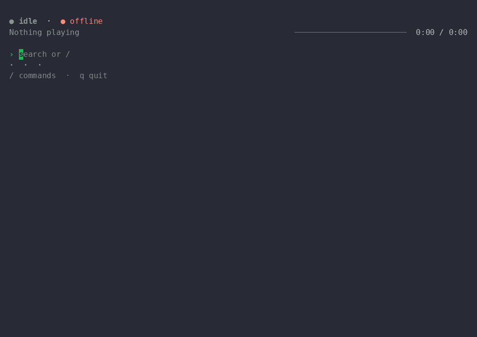
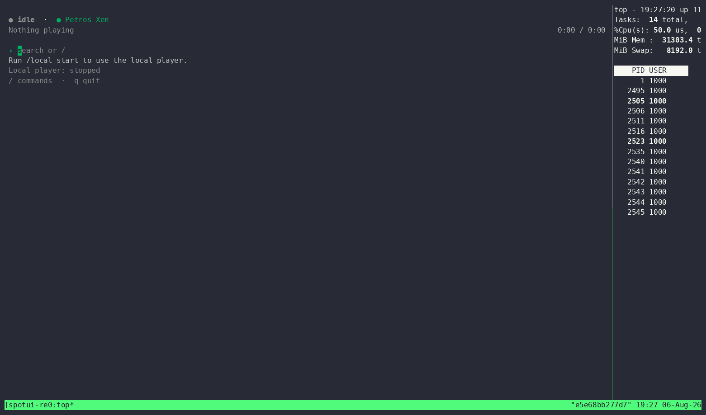

# spotui

Terminal Spotify controller with a CLI and Bubble Tea TUI, plus optional lightweight local playback via `spotifyd`.

## Screenshots



> GIFs connect to Spotify on load — give them a few seconds to show real activity.

Adaptive layout, live in a resized split pane alongside another program:



Raw terminal recordings: [spotui-demo.cast](./docs/screenshots/spotui-demo.cast), [spotui-resize-demo.cast](./docs/screenshots/spotui-resize-demo.cast)

## Features

- CLI and TUI in one binary
- Spotify Authorization Code with PKCE
- Search tracks and playlists, with fuzzy matching for `/device` and `/play`
- Device listing and preferred-device selection
- Optional managed local playback with `spotifyd`
- Inline autocomplete and ghost completion
- Adaptive layout that reflows from a wide terminal down to a narrow split pane
- Clear error handling for auth expiry, Premium requirements, rate limits, and connectivity issues

## Requirements

- Go 1.24.2+
- Spotify app client ID
- Spotify Premium for playback control
- `spotifyd` on Linux for local playback without the full Spotify desktop app (prefer the upstream release binary over the Homebrew build — it has a fuller backend set for PipeWire/PulseAudio setups)

## Quick Start

1. Create a Spotify app at <https://developer.spotify.com/dashboard> and add this redirect URI: `http://127.0.0.1:8888/callback`
2. Export your client ID and build:

```bash
export SPOTUI_CLIENT_ID=your_spotify_client_id
go build -o spotui ./cmd/spotui   # or: task build
./spotui login --client-id "$SPOTUI_CLIENT_ID"
./spotui tui
```

## Usage

```bash
spotui --help              # full command reference
spotui login --client-id "$SPOTUI_CLIENT_ID"
spotui devices
spotui search "daft punk"
spotui play track 3        # or a Spotify ID/URI, from search results
spotui use kitchen         # set preferred device by substring match
spotui tui
```

### Local Playback

```bash
spotui local status
spotui local start
spotui local use
spotui local reset
spotui local stop
```

Recommended config shape:

```json
{
  "local_player": {
    "backend": "pulseaudio",
    "spotifyd_path": "/home/you/.local/bin/spotifyd"
  }
}
```

On PipeWire desktops, leave `audio_device` empty unless you need to force a sink.

## TUI

Run `spotui tui` for the interactive interface: type a query and press `Enter` to search, `/help` for the slash-command list, `Tab` for autocomplete, `q`/`Ctrl+C` to quit.

`/local` expands to local-player subcommands (`start`, `stop`, `use`, `status`, `reset`); `/device` uses known Spotify devices; `/play` uses the latest search results.

## Config

Stored in `~/.config/spotui/`: `config.json` (client ID, redirect URI, preferred device, local-player settings, caches) and `token.json` (Spotify tokens, mode `0600`, atomic writes).

```bash
export SPOTUI_CLIENT_ID=your_spotify_client_id
export SPOTUI_REDIRECT_URI=http://127.0.0.1:8888/callback
```

`local_player` fields in `config.json`:

| Field | Default | Description |
| --- | --- | --- |
| `enabled` | `false` | Intent flag surfaced in `spotui local status`; use `spotui local start`/`stop` to actually control `spotifyd` |
| `device_name` | `"spotui"` | Spotify Connect device name the managed `spotifyd` advertises |
| `backend` | `"portaudio"` | Audio backend passed to `spotifyd` (e.g. `pulseaudio`, `alsa`) |
| `audio_device` | `""` | Output device; empty uses `spotifyd`'s default |
| `bitrate` | `320` | Streaming kbps; valid values `96`/`160`/`320`, else resets to `320` |
| `initial_volume` | `100` | `0`-`100`; out-of-range resets to `100` |
| `spotifyd_path` | `""` | Path to the `spotifyd` binary; empty looks up `PATH` |
| `use_mpris` | `true` | Enables MPRIS (D-Bus) integration; set `false` on systems without a D-Bus session bus |

## Troubleshooting

**No active device** — start Spotify on a desktop, mobile, or web player, then run `spotui devices` or `/devices`. If `spotifyd` is installed, try `spotui local use`; if local-player state is stuck, run `spotui local reset`.

**`spotifyd` exits during startup** — `spotui` prints the tail of the managed `spotifyd` log. Common causes: unsupported backend, invalid `audio_device`, or no D-Bus session bus (set `"use_mpris": false` in `local_player`). Full log: `~/.config/spotui/runtime/spotifyd/spotifyd.log`.

**Linux audio backend issues** — on PipeWire, prefer an upstream `spotifyd` full build with `backend = "pulseaudio"`, and avoid forcing `audio_device`. PortAudio-specific device errors are usually a `spotifyd` build issue, not `spotui`.

**Login expired** — `spotui login --client-id "$SPOTUI_CLIENT_ID"`

**Premium required** — playback control requires Spotify Premium.

**Rate limited** — `spotui` backs off automatically on `429`.

## QA Review Bundle

`task qa:tui-review` generates a deterministic multi-layout TUI review bundle in `docs/qa/tui-review/` (SVG renders, text captures, a review-brief prompt, and a manifest) for visual-polish QA, separate from the main binary.

PRs touching TUI surfaces also run the `TUI Review` GitHub Actions workflow, which builds the bundle, sends it to OpenAI for review, and posts a sticky PR comment with blocker-level findings. Requires an `OPENAI_API_KEY` secret; adjust the model in `.github/workflows/tui-review.yml` if needed.

## Development

```bash
go test ./...
```
